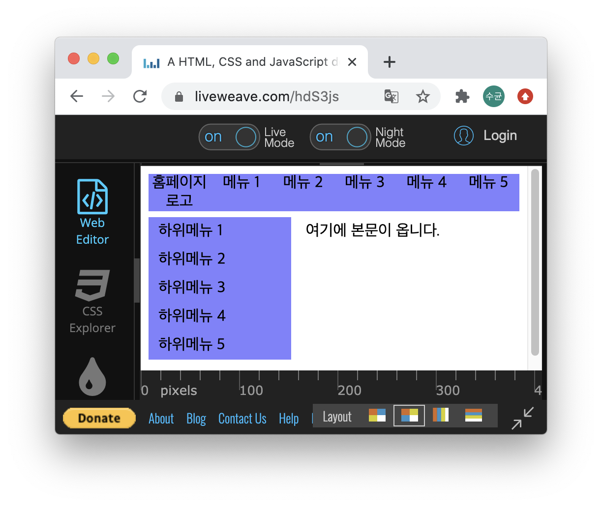

# CSS로 페이지 꾸미기

CSS는 Cascading Style Sheets의 약자로, 웹페이지를 꾸미기 위해 작성하는 코드입니다.

> ~~저도 웹디자인을 공부해본적은 없습니다만...~~

과거에는 웹이 정적으로 사용자와 Button, Input 등에 의해 제한적으로 소통했다면, 현대와 미래의 웹은 좀 더 직관적이고 신속한 **반응성(Reactiveness)**을 주요 평가요소로 보고 있습니다.

HTML로 웹페이지를 설계할 때 Table 요소를 주로 사용하였는데, 아래와 같은 꼴입니다.

```html
<table width="800" cellpadding="0" cellspacing="0" border="0" align="center">
    <tr bgcolor="#8080FF" align="center">
        <td width="100">홈페이지 로고</td>
        <td width="100">메뉴1</td>
        <td width="100">메뉴2</td>
        <td width="100">메뉴3</td>
        <td width="100">메뉴4</td>
        <td width="100">메뉴5</td>
        <td width="200"><!-- 여백 --></td>
    </tr>
    <tr height="5">
        <td colspan="7"><!-- 여백 --></td>
    </tr>
    </table>

    <table width="800" cellpadding="0" cellspacing="0" border="0" align="center">
    <tr>
        <td width="150" valign="top" bgcolor="#8080FF">
            <table width="130" cellpadding="5" cellspacing="0" border="0" align="center">
            <tr>
                <td>하위메뉴1</td>
            </tr>
            <tr>
                <td>하위메뉴2</td>
            </tr>
            <tr>
                <td>하위메뉴3</td>
            </tr>
            <tr>
                <td>하위메뉴4</td>
            </tr>
            <tr>
                <td>하위메뉴5</td>
            </tr>
            </table>
        </td>
        <td width="650" valign="top">
            <table width="600" cellpadding="0" cellspacing="0" border="0" align="center">
            <tr>
                <td>여기에 본문이 옵니다.</td>
            </tr>
            </table>
        </td>
    </tr>
</table>
```
[링크를 통해 결과를 확인해보세요!!](https://liveweave.com/BeGxQ0)

하지만, Table은 정적이고 각 데이터의 위치가 정해져 있습니다. HTML을 작성하는 순간 정해지는 방식이죠. 그렇다보니, **디자인요소가 HTML과 구분되지 않는 불편함이 생기고, HTML 구성이 복잡해집니다.**

물론, CSS를 비롯한 부가적인 웹의 구성요소가 불의로 인하여 load 되지 않았을 경우 Table 기반 웹은 **그나마 데이터의 형태를 유저에게 잘 전달할 수 있다는 장점이 있습니다.**

반응형 웹의 경우, CSS가 빠지면 정말 못생겨집니다.


이번엔 `<div> <ul> <li>` 등과 CSS를 활용하여 위의 내용을 그려보겠습니다.

```html
<body>
  <ul class="upper-bar">
    <li>홈페이지 로고</li>
    <li>메뉴 1</li>
    <li>메뉴 2</li>
    <li>메뉴 3</li>
    <li>메뉴 4</li>
    <li>메뉴 5</li>
  </ul>
  
  <div class="mid-container">
    <ul class="side-bar">
      <li>하위메뉴 1</li>
      <li>하위메뉴 2</li>
      <li>하위메뉴 3</li>
      <li>하위메뉴 4</li>
      <li>하위메뉴 5</li>
    </ul>
  
    <div class="article">
      <p>여기에 본문이 옵니다.</p>
    </div>
  </div>
</body>
```

```css
.upper-bar {
  list-style: none;
  padding: 0;
  margin: 0;
  display: flex;
  flex-wrap: none;
}

.upper-bar li {
  text-align: center;
  width: 100px;
  background-color: #8080FF;
}

.mid-container {
  display: flex;
  margin-top: -10px;
}

.side-bar {
  list-style: none;
  padding-left: 0;
}

.side-bar li {
  background-color: #8080FF;
  width: 130px;
  padding: 5px 5px 5px 10px; 
}

.article p {
  padding: 5px 5px 5px 15px;
}
```

[링크를 통해 결과를 확인해보세요!!](https://liveweave.com/hdS3js)

하는 일이 같은데 왜 이렇게 웹을 설계하는게 반응형 웹을 만드는데에 유리할까요? 결론적으로 말하자면, JavaScript와 CSS가 할 수 있는 일이 많아지기 때문입니다.

HTML과 JS, 그리고 CSS의 개별적인 설계는 각각의 유지보수와 효율적인 작업에 도움을 줄 뿐만아니라, 각 요소가 지원하는 상호작용으로 이전에는 불가능했던 애니메이션이나 화려한 연출이 가능해졌으며, 무엇보다 `@media` 쿼리와 같은 [CSS3](https://www.samsungsds.com/global/ko/support/insights/Responsive-Web-2.html)의 기능으로 모바일 디바이스의 작은화면을 같은 HTML에서 보여줄 수 있게 됩니다.




**차이가 느껴지시나요??** 사실 이러한 장점은 아주 사소한 것에 불과합니다. 또한 우리가 만든 테스트 페이지에서 모든 것을 보여주기에 한계가 있죠.

---

## 그래서 CSS가 우째 생겼는디

CSS의 Rule은 아래와 같이 정의됩니다.


[선택자(Selector)](http://www.nextree.co.kr/p8468/)로는 이하 내용들이 적용될 HTML요소를 선택합니다. 위 사진에서는 문서내의 `<p>`태그 전체에 대해 속성을 지정하려고 하고 있습니다.

속성(Property)와 값(Property value)는 선택자로 인해 선택된 HTML요소가 **어떻게 보일지(또는, 브라우저가 어떻게 그려낼지)**를 정합니다. 예를 들면, color(아마도 색상이겠죠?) 속성을 red(아마도 빨강..)에 대입시켰다면, 해당 요소의 색상을 빨간색으로 칠하는거죠.

안타깝게도, 이 자리에서 **모든** 속성이 각각 어떤 일을 하는지를 설명할 수는 없습니다. 하지만 이에 대한 [좋은 강좌](https://ofcourse.kr/css-course/%EC%86%8D%EC%84%B1)들이 많이 있으니 관심의 유무에 따라 공부해보시기 바랍니다.

> HTML과 CSS의 설계 스킬은 경험적으로 습득하는 것이 바람직하다고 생각합니다. 빠르게 변하는 웹 시장에서 기술적, 심미적 요소에 대해 완벽하게 공부할 수는 없으니까요!! 웹개발에 관심을 가지고 책과 구글링을 통해 여러 데모페이지들을 만들어 가다보면, 여러분의 스타일이 생기게 될 테죠.

---

